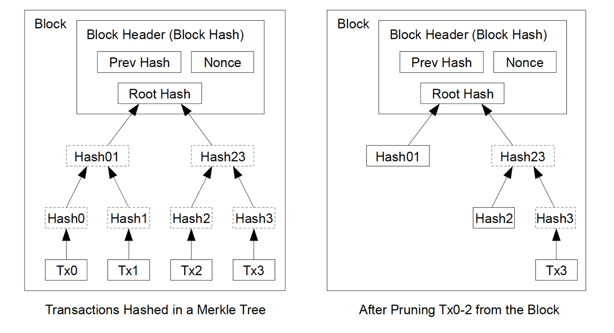

## OpenZepplin 2.0 源代码详解 - part1

#### 算术运算（math）

* 基本算数（Math.sol）- library

  library 中的 internal 类型的函数，必须用 using for 的方式来调用。

* 安全算数（SafeMath.sol）- library

  library 中的 internal 类型的函数，必须用 using for 的方式来调用。

#### 密码学（cryptography）

* 椭圆曲线签名操作（ECDSA.sol）- library

  library 中的 internal 类型的函数，必须用 using for 的方式来调用。

* 默克尔证明（MerkleProof.sol）- library

  library 中的 internal 类型的函数，必须用 using for 的方式来调用。

  

#### 通用工具（utils）

- 地址工具（Address.sol）- library

  library 中的 internal 类型的函数，必须用 using for 的方式来调用。

  注意在合约的构造函数执行过程中，合约的关联代码是空。

- 数组工具（Arrays.sol）- library

  library 中的 internal 类型的函数，必须用 using for 的方式来调用。

- 拒绝重入（ReentrancyGuard.sol）- contract

  通常建议将函数具体实现和控制调用的 wrapper 分为两个函数。

```javascript
  function logicWrapper() public nonReentrant {
      logic();
  }
  
  function logic() internal {
      ...
      ...
  }
```

#### 自省（Introspection）

> ERC = Ethereum Request for Comments
>
> EIP = Ethereum Improvement Proposal
>
> https://github.com/ethereum/EIPs

* IERC165 - interface

* ERC165 - contract

* ERC165Checker - library

  注意理解 `_callERC165SupportsInterface` 这个函数。

#### 归属权（ownership）

* 归属（Ownable.sol）- contract

  注意 renouceOwnership 这个函数。

* 从属（Secondary.sol）- contract

  注意这两个基础合约仅有的区别。

#### 访问控制（access）

* 角色（Roles.sol）- library

  library 中的 internal 类型的函数，必须用 using for 的方式来调用。
  
* CapperRole - contract
* MinterRole - contract
* PauserRole - contract
* SignerRole - contract

  四个有特殊业务意义的角色模版合约，代码逻辑是一样的。

#### 生命周期（lifecycle）

* 可暂停运作（Pausable.sol）- contract

#### 支付（payment）

* 分割付款（PaymentSplitter.sol）- contract

  注意理解这个合约的数据设计和 release 函数的逻辑。（为什么不在每次账户余额变动的时候去计算每个 payee 的可提取额度，并单独保存他们的可提取额度？）

  理解这个合约的实践意义（比如可以用于 DAO 或者股东分红等场景）。

* 托管（Escrow.sol）- contract

  合约继承自 Secondary，而不是 Ownable。

* 条件托管（ConditionalEscrow.sol）- contract

* 偿还托管（RefundEscrow.sol）- contract

  注意这个合约重写了 deposit 函数；用了一个 enum 来控制合约状态；实现了 ConditionalEscrow 的 withdrawAllowed 函数。

* 需收款人主动提取的付款（PullPayment.sol）- contract

  这是一个安全的付款模式（也就是所谓的 withdraw 模式），有很强的实践意义。
