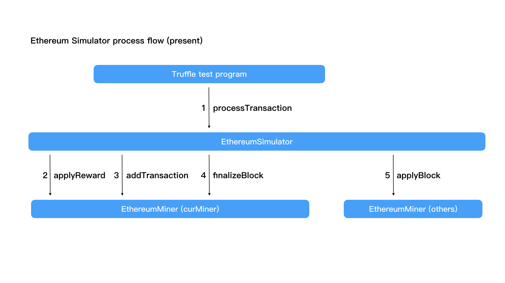
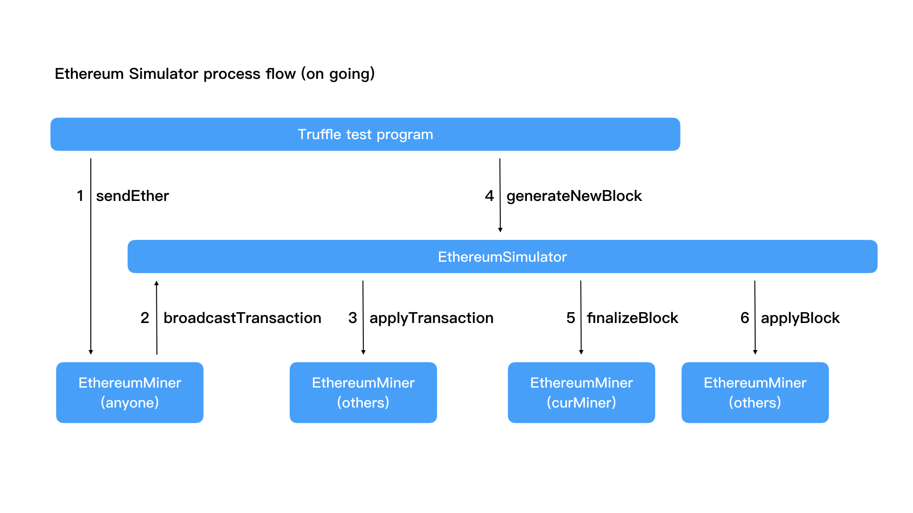

# 第八课作业

在读懂第八课视频中讲解的 Ethereum Simulator 程序的前提下进行实现细节的调整。

目前的处理流程大致如下图所示：

请参考目前已实现的代码逻辑，将其修改为下图所示的新处理流程：

以下是对新流程的一些细节说明：

1. 测试程序（truffle test program）直接调用任意一个 EthereumMiner 合约实例的 sendEther 函数。这个函数需要大家新增，其参数表应该与目前 EthereumSimulator 合约的 processTransaction 相同。这个函数在将交易数据生成并保存到自己的 transactionPool 之后，直接调用 EthereumSimulator 的 broadcastTransaction 函数，broadcastTransaction 函数应该简单地调用其他矿工的 applyTransaction 函数，将这个新产生的交易数据存储到矿工各自的 transactionPool 中。
2. EthereumSimulator 的 broadcastTransaction 函数需要新增，它应该接收一个序列化（ABI 编码）的交易数据（bytes 类型），而后简单地分别调用其他矿工的 applyTransaction 函数（这个函数应该接收一个 bytes 类型的输入参数），将交易数据进行“广播（转发）”。这个逻辑与目前的 processTransaction 函数中广播区块数据的逻辑类似。
3. 测试程序（truffle test program）调用 EthereumSimulator 合约实例的 generateNewBlock 函数来生成一个新区块，这也是个需要新增的函数。与目前的 processTransaction 函数类似，它只需要调用 curMiner 的 finalizeBlock 函数，获得序列化的区块数据之后，分别调用其他 EthereumMiner 的 applyBlock 函数进行“广播（转发）”即可。
4. 在新的流程里，原先 EthereumMiner 的 applyReward 函数可以直接改为 private/internal，在 finalizeBlock 函数和 applyBlock 函数中直接调用。
5. 基于新的流程，为了解决“初始 Ether”的问题，大概需要允许 finalizeBlock 函数在 transactionsPool 中没有交易数据时也可以创建区块。这需要修改 finalizeBlock 函数的逻辑，因为目前的数据结构中 BlockHeader 里没有标示区块中交易数量的字段，所以为了最小化修改代码，可以在 transactionsPool 中没有交易数据时，生成一个所有字段均为 0 的空交易作为新区块中的交易。与此对应，为了让测试程序能正常运作，测试程序中大概需要增加一步，在循环发送交易数据之前，先调用一次 generateNewBlock 函数发放一次区块奖励；按目前的逻辑，这个区块奖励会发放到 Miner1（accounts[1]）然后随机选择下一个 Miner。
6. 原先在 processTransaction 中的相关检查，大概需要移到 finalizeBlock 函数中，因为新的 sendEther 函数只是基于输入参数生成交易数据并通过 EthereumSimulator 进行转发，这时可以不检查交易数据的有效性。（在本例中，因为转账是从区块奖励地址发出的，所以在创建交易时检查余额会“余额不足”。）finalizeBlock 函数开头就应该调用 applyReward 函数，否则就将出现余额不足的错误。
7. 在新的调用流程下，applyBlock 函数中也应该将 transactionsPool 的数据清除；原先的处理流程中这是不需要的。
8. 交易数据的反序列化，其实在 initTransactionFromBlockData 函数中已经实现了，新的流程中对交易数据的反序列化，可以考虑复用这个函数中的绝大部分代码。

基于新的流程，EthereumSimulator 和 EthereumMiner 的对外接口都有变化，请注意相关代码的修改（比如接口的注册和相应检查）。与之相应地，测试程序当然也需要部分修改，参考现有程序应该很容易完成。

新增流程中最难的部分就是对交易数据的序列化和反序列化。交易数据的序列化，可以参考现有代码，用 abi.encode 简单实现（因为交易中的字段是固定的，仅最后的 data 字段是动态类型）；反序列化，需要使用内联汇编，按字从输入数据中取得（或参考 applyBlock 的方式，先将输入数据拷贝到内存中的新 bytes 中来进行）。

要完成这个作业，请 fork 下列工程再创建新分支直接修改代码：

https://git.yikuailianxi.com/adv_ethereum_s1/lesson8-sources.git

代码修改完成之后请测试通过再提交。
